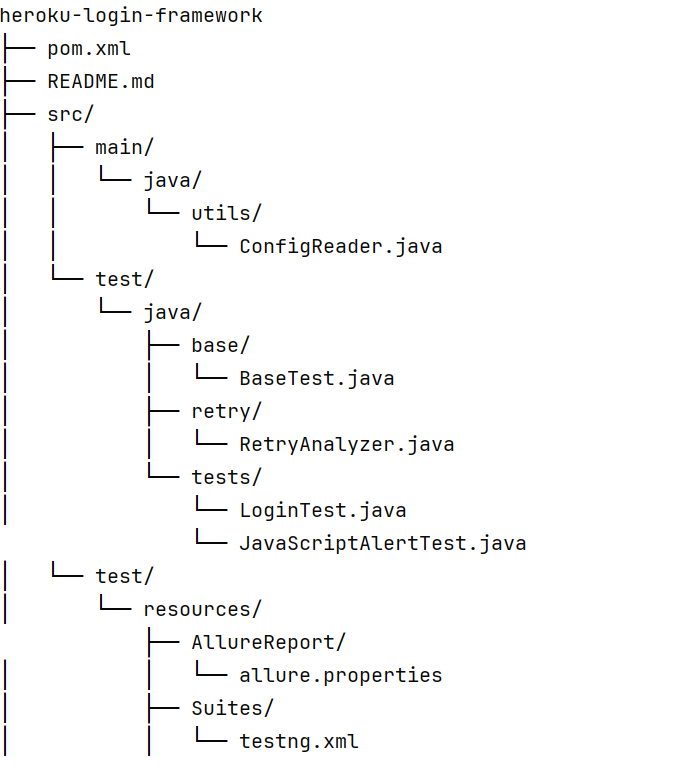

# Heroku Login Automation Framework

This is a Selenium Java TestNG framework designed to automate login functionality of [Heroku login page](https://the-internet.herokuapp.com/login) with the following features:

- Secure credential management using **environment variables**
- **Parallel execution** with TestNG
- **Retry logic** for flaky/failed tests
- **Allure reporting** support
- Support for **LambdaTest remote execution** with **session ID logging**

## Project Structure



```
heroku-login-framework/
├── pom.xml                                     # Maven project file            
├── src/
│   ├── main/java/utils/ConfigReader.java       # Reads credentials from env vars
│   └── test/java/
│       ├── base/BaseTest.java                  # Common WebDriver setup
│       ├── retry/RetryAnalyzer.java            # Retry logic for failed tests
│       └── tests/
               └── LoginTest.java               # Valid and invalid login tests
               └── JavaScriptAlertTest          # Handle JS Alerts
     └── test/resources/
│       ├── AllureReport/allure.properties      # Allure configuration
│       ├── Suites/testng.xml                   # TestNG suite file


```

### pom.xml dependencies
Add following dependencies in pom.xml

- selenium-java
- testng
- webdrivermanager
- allure-testng

Add following plugins in pom.xml

- maven-compiler-plugin
- maven-surefire-plugin

## Key Features
- Secure credential management using **environment variables** (no hardcoded secrets)
- **Parallel execution** using TestNG configuration
- **Retry logic** for failed tests
- **Allure reporting** for beautiful test result visualization
- **LambdaTest integration** with **session ID logging** for easy traceability


------------


## Key Design Decisions

### 1. **Environment Variables for Security**
We chose to use `System.getenv()` to load secrets like Heroku credentials and LambdaTest credentials instead of storing them in `properties` or `xml` files. This ensures no sensitive information is committed to version control, making the project more secure and cloud/deployment friendly.

### 2. **Retry Analyzer**
Implemented `RetryAnalyzer` for rerunning flaky/failed test cases automatically up to a limit of 2 retries, improving test reliability in CI environments.

### 3. **LambdaTest RemoteWebDriver Integration**
To ensure the framework can run cross-browser and in cloud environments, we configured tests to run remotely on LambdaTest. The session ID is printed to track executions easily in LambdaTest dashboard.

### 4. **Allure Reporting**
Allure is used to generate attractive and structured test reports. It integrates seamlessly with TestNG.

### 5. **Scalable Test Structure**
The framework separates concerns with packages like `base`, `utils`, `retry`, and `tests`, allowing for easy expansion in future (like adding Page Object Model).


------------

### Lambda Test Execution Results


### Allure Report


-------------


### Run Tests Locally

```bash
mvn test
```


### Run on LambdaTest
Just ensure `LT_USERNAME` and `LT_ACCESS_KEY` are set correctly. Framework will auto-use RemoteWebDriver.

### Generate Allure Report

```bash
mvn allure:serve